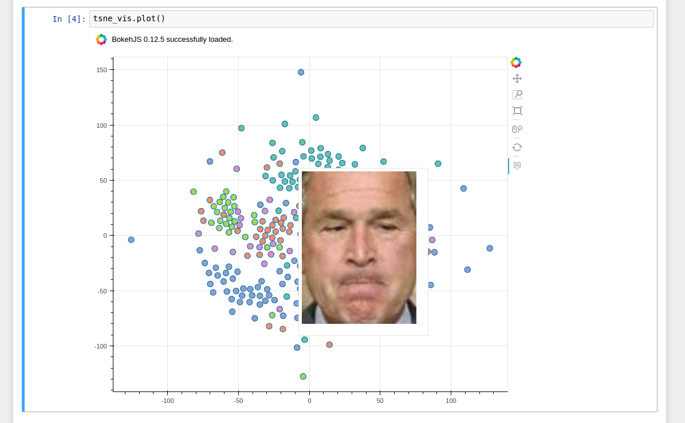
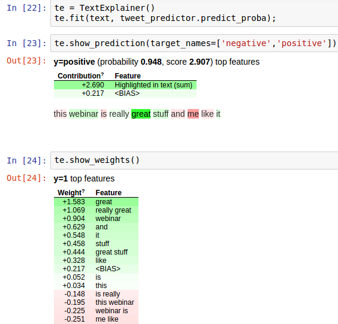

# deepsense.io webinar 

## Unblackboxing the black box webinar

## This is what it is all about

- Class Activation Maps


- Saliency Maps


- Maximal Activation Image


- Quiver


- TSNE


- Neptune


- Tensorboard


- LIME


- Attention


## Prerequisites
Install the requirements

```bash
pip install -r requirements.txt
```

Download Twitter Sentiment Dataset from http://thinknook.com/wp-content/uploads/2012/09/Sentiment-Analysis-Dataset.zip

 or via
 
```bash
wget http://thinknook.com/wp-content/uploads/2012/09/Sentiment-Analysis-Dataset.zip
```

Run the following preprocessing script with filepaths specified 
For example:
```bash
python preprocess_twitter.py -sf my/path/to/data/Sentiment\ Analysis\ Dataset.csv -df my/path/to/data/tweet_sentiment.csv
```

Download the pretrained glove model from https://nlp.stanford.edu/projects/glove/ and unpack it to some folder.

Specify the filepaths in `read_between_the_tweets.py` and train your twitter model by running:
```bash
python read_between_the_tweets.py
```


## Resources and Acknowledgements

Thank you all for letting the world use this!

Keras.io https://keras.io/

Keras-vis https://raghakot.github.io/keras-vis/

Neptune http://neptune.deepsense.io/versions/latest/

Eli5 http://eli5.readthedocs.io/en/latest/overview.html

LIME https://homes.cs.washington.edu/~marcotcr/blog/lime/

Quiver https://github.com/keplr-io/quiver

Tensorflow https://www.tensorflow.org/

https://jacobgil.github.io/deeplearning/class-activation-maps

https://arxiv.org/abs/1312.6034

http://p.migdal.pl/2017/01/06/king-man-woman-queen-why.html

https://nlp.stanford.edu/projects/glove/

http://blog.echen.me/2017/05/30/exploring-lstms/

https://github.com/philipperemy/keras-attention-mechanism

https://medium.com/@plusepsilon/visualizations-of-recurrent-neural-networks-c18f07779d56

https://richliao.github.io/supervised/classification/2016/12/26/textclassifier-RNN/

https://arxiv.org/pdf/1409.0473.pdf

https://gist.github.com/wassname/5292f95000e409e239b9dc973295327a

https://gist.github.com/nigeljyng/37552fb4869a5e81338f82b338a304d3


## This is us

[](https://deepsense.io/)

[](https://www.codilime.com/)

[](https://deepsense.io/neptune-early-adopter-program/)
